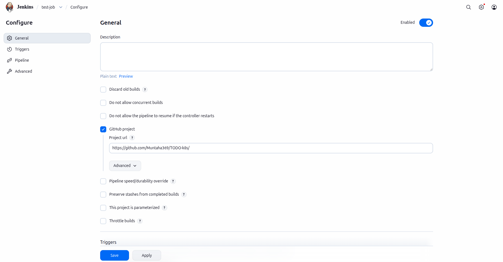
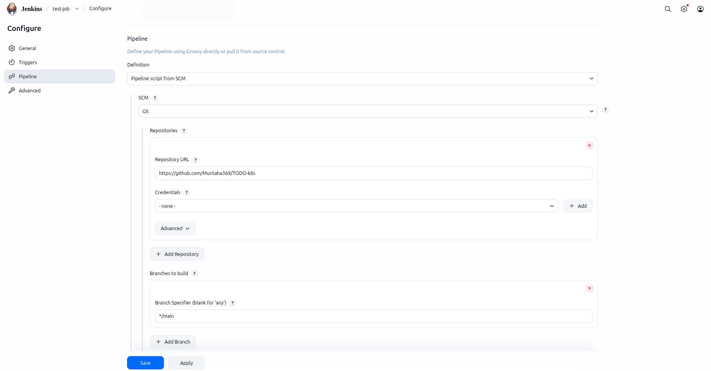
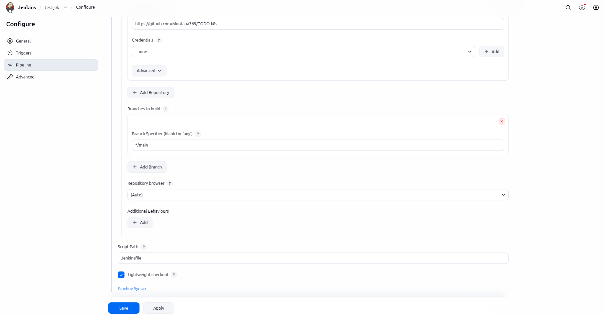

To connect a master container to a slave container via SSH, you’ll need two Ubuntu-based containers with SSH client on the master and SSH server on the slave. Here’s a step‑by‑step guide using Docker.

## 1. Create a Docker network
Containers need a way to communicate. A user‑defined bridge network is perfect.

```bash
docker network create jenkins-net
```

## 2. Run the slave container (SSH server)
The slave must have an SSH server installed and running.

```bash
  docker run -d \
  --name jenkins-agent \
  --network jenkins-net \
  -v /var/run/docker.sock:/var/run/docker.sock \
  ubuntu:latest \
  sleep infinity
```

Now install and start the SSH server inside the slave:

```bash
docker exec -it jenkins-agent bash
```

Inside the jenkins-agent:

```bash
#Install Java
apt update && apt install -y openjdk-17-jre-headless
# Install SSH
apt update && apt install -y openssh-server
# Start the SSH service
service ssh start
# Set a password for root (or create a new user)
passwd
# Install nano
apt-get install nano
# Edit this config
nano /etc/ssh/sshd_config
# Add below two line after nano
#PermitRootLogin yes
#PasswordAuthentication yes
# Exit the container
exit
```

> **Security tip**: Using a password is fine for testing. For production, set up SSH keys.

## 3. Run the master container (SSH client)
The master only needs the SSH client (and possibly tools like `ping` to test connectivity).

```bash
docker run -d \
  --name jenkins \
  --network jenkins-net \
  -p 8081:8080 \
  -p 50000:50000 \
  -v jenkins_home:/var/jenkins_home \
  -v /var/run/docker.sock:/var/run/docker.sock \
  jenkins/jenkins:lts
```

Install the SSH client:

```bash
docker exec -u root -it jenkins bash
apt update && apt install -y openssh-client
service ssh start
exit
```

## 4. Find the slave’s IP address
You can get it from inside the master or with Docker:

```bash
docker inspect jenkins-agent| grep IPAddress
```

Or from inside the master:

```bash
docker exec -it jenkins bash
ping jenkins-agent   # Should respond (the container name resolves thanks to the custom network)
```

## 5. Connect from master to slave
From the master’s shell:

```bash
docker exec -it jennkins bash
ssh root@jenkins-agent or ssh root@<agent-IP>   # or use the IP address if name resolution fails
```

When prompted, accept the host key and enter the password you set for root.

## Example with SSH keys (more secure)

1. Generate a key pair on the master:
   ```bash
   docker exec -it jenkins ssh-keygen -t rsa -N "" -f /root/.ssh/id_rsa
   ```

2. Copy the public key to the slave:
   ```bash
   docker exec -it jenkins ssh-copy-id root@jenkins-agent  # you'll need the password for the first copy
   ```
   (If `ssh-copy-id` is not installed, install `openssh-client` on the master first.)

3. Now you can log in without a password:
   ```bash
   docker exec -it jenkins ssh root@jenkins-agent
   ```

## 6. Configure node in jenkins


Click save and apply

## 7. Creating a job


